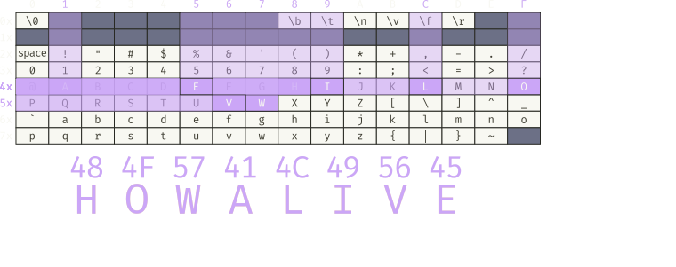
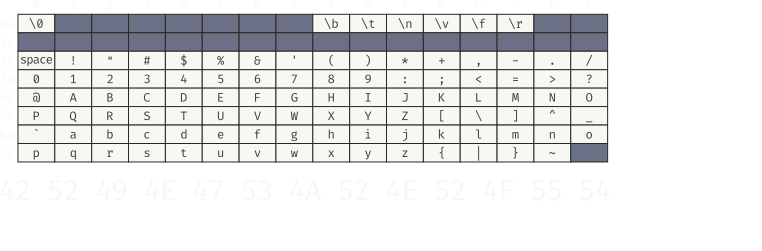
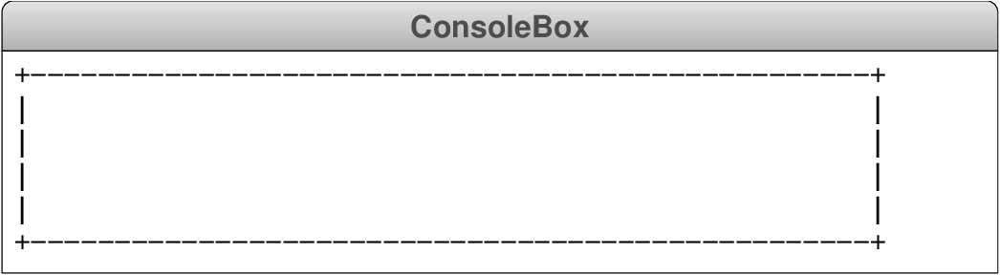

## Problem 1a
- Suppose that the function `mystery` is defined as:
  ```mypython
  def mystery(x, y):
    while x != 0 and y != 0:
        if x > y:
            x -= y
        else:
            y -= x
    return max(x, y)
  ```
  Trace through the execution of the function to find the value of:
  `mystery(77, 42)`{.inlinecode}


## Tracing the `mystery` function {data-state='MysteryTrace'}
<table id="MysteryTable">
<tbody style="border:none;">
<tr><td><div id="MysteryTrace" style="margin:0px;"></div></td></tr>
<tr><td>
<div id="MysteryBanner" style="margin:0px; padding:0px;">Console</div>
</td></tr>
<tr><td><div id="MysteryConsole"></div></td></tr>
<tr>
<td style="text-align:center;">
<table class="CTControlStrip">
<tbody>
<tr>
<td>

</td>
<td>

</td>
</tr>
</tbody>
</table>
</td>
</tr>
</table>

:::incremental
- This function calculates the greatest common divisor of `x` and `y` as Euclid described it in his _Elements_.
:::


## Problem 1b
- Suppose that the function `puzzle` is defined as:
  ```mypython
  def puzzle(n):
    s = 0
    for i in range(1, 2 * n, 2):
        s += i
    return s
  ```
  Trace through the execution of the function to find the value of `puzzle(8)`.


## Tracing the `puzzle` function {data-state='PuzzleTrace'}
<table id="PuzzleTable">
<tbody style="border:none;">
<tr><td><div id="PuzzleTrace" style="margin:0px;"></div></td></tr>
<tr><td>
<div id="PuzzleBanner" style="margin:0px; padding:0px;">Console</div>
</td></tr>
<tr><td><div id="PuzzleConsole"></div></td></tr>
<tr>
<td style="text-align:center;">
<table class="CTControlStrip">
<tbody>
<tr>
<td>

</td>
<td>

</td>
</tr>
</tbody>
</table>
</td>
</tr>
</table>

:::incremental
- This function calculates the sum of the first `n` odd integers, which always works out to $n^2$.
:::


## Problem 2
- In both the novel and the movie version of Andy Weir's 2011 bestseller _The Martian_, Mark Watney (played by Matt Damon in the film) communicates with Earth by recovering the long-dormant Sojourner rover, recharging its batteries, and using its communication system to send video signals to Earth through Sojourner's camera.
- Communication from NASA back to Mars, however, is more challenging because the only thing the Earth based operators can do is rotate the camera. Mark's solution is to position 16 flags in a circle around the camera, each of which is labeled with a hexadecimal digit(0-F), and then have the NASA technicians rotate the camera to spell out the words in the ASCII subset of unicode.


## {data-background-video="https://willamette.edu/~esroberts/Movies/TheMartian-ASCII.mp4" data-background-size="contain"}


## Decoding a Message
- The first message that Mark decodes looks like this:



<div class='fragment'></div>


## Exercise: ASCII Decoding
- Decode the following message, which appears in the book but not in the movie:




## Problem 3
:::incremental
- Write a function `draw_console_box(width, height)` that draws a box on the console with the specified dimensions. The corners of the box should be represented using a plus sign (`+`), the top and bottom borders using a minus sign (`-`), and the left and right borders using a vertical bar (`|`).
- For example, calling `draw_console_box(52, 6)` should produce the following diagram:
  
:::

## Some Considerations
- As usual, breaking things down will usually help. Some things to think about may include:
  - Different lines have different content. How will you track what you should be printing on a given line?
    - How can you generate the necessary line to print?
    - How will you determine how many characters of different types to print on a line?
  - How will you manage printing multiple lines?


## One Solution: Drawing a Console Box {data-state='DrawConsoleBoxTrace'}

<table id="DrawConsoleBoxTable">
<tbody style="border:none;">
<tr><td><div id="DrawConsoleBoxTrace" style="margin:0px;"></div></td></tr>
<tr>
<td>
<div style='display: flex'>
  <table style='flex-grow: 2'>
  <tbody>
  <tr><td style="padding:0px"> <div id="DrawConsoleBanner" style="margin:0px; padding:0px;">Console</div> </td></tr>
  <tr><td style="padding:0px"> <div id="DrawConsoleConsole"></div></td></tr>
  </tbody>
  </table>
  <table class="CTControlStrip" style='flex-grow: 1'>
  <tbody>
  <tr>
  <td>
  
  </td>
  <td>
  
  </td>
  </tr>
  </tbody>
  </table>
</div>
</td>
</tr>
</tbody>
</table>


## Problem 4
- Many times you will find yourself in situations wherein the algorithm you want to implement to solve a particular problem is already known, and thus you need only to implement it.
- The date of Easter is determined to be the first Sunday after the first full moon after the vernal equinox. Methods of computing this date back to the third century, but involved looking up frequent values across different tables.
- Here, you seek to implement the algorithm of Karl Friedrich Gauss, which was published in 1800 and unique in being the first purely computational algorithm for computing the date of Easter.
- Your function should take the year as an argument, and return the date of Easter as a month-day string, e.g. `"April 13"`


## Gauss's Algorithm
- Divide the number of the year for which one wishes to calculate the date of Easter by 19, by 4, and by 7, and call the remainder of these divisions `a`, `b`, and `c`, respectively.
- Divide the value $19a + 24$<sup class='orange'>*</sup> by 30, and call the remainder `d`.
- Divide the value $2b + 4c + 6d + 5$<sup class='orange'>*</sup> by 7, and call the remainder `e`.
- If $d+e$ is less than 10, then Easter falls on March $22+d+e$
  - Otherwise it falls on April $d + e - 9$

<hr>
<span class='orange'>*</span> Values change every century. These two numbers are good for 2000-2099. There is a way to computationally calculate them, if you are interested.


## Testing
- Use the below dates to Easter to write a function to check your previously written function using `assert` statements

:::{style='margin:auto'}

| Year | Easter Date |
|------|:-----------:|
| 2020 |   April 12  |
| 2021 |   April 4   |
| 2022 |   April 17  |
| 2023 |   April 9   |
| 2024 |   March 31  |
| 2025 |   April 20  |

:::

## One Possible Implementation
```{.mypython style='max-height:900px'}
def compute_easter(year):
    """
    Computes the date of Easter on any year from 2000-2099
    """
    a = year % 19
    b = year % 4
    c = year % 7
    d = (19 * a + 24) % 30
    e = (2 * b + 4 * c + 6 * d + 5) % 7
    if d + e < 10:
        return "March" + str(22 + d + e)
    else:
        return "April" + str(d + e - 9)
```
